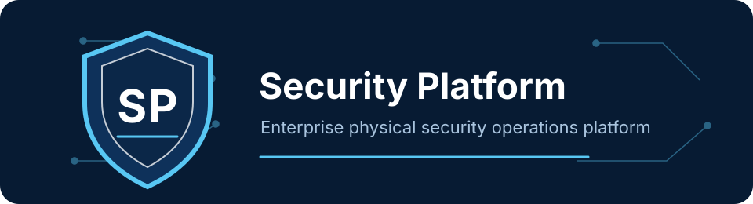
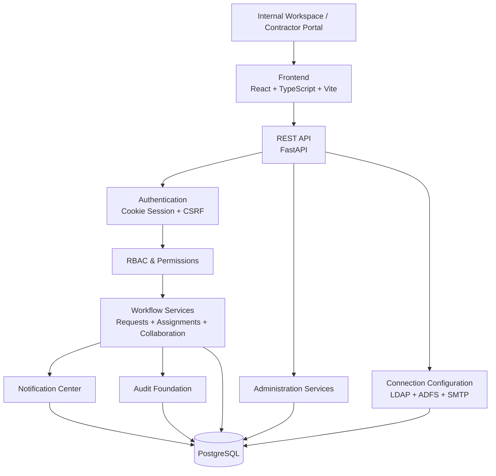
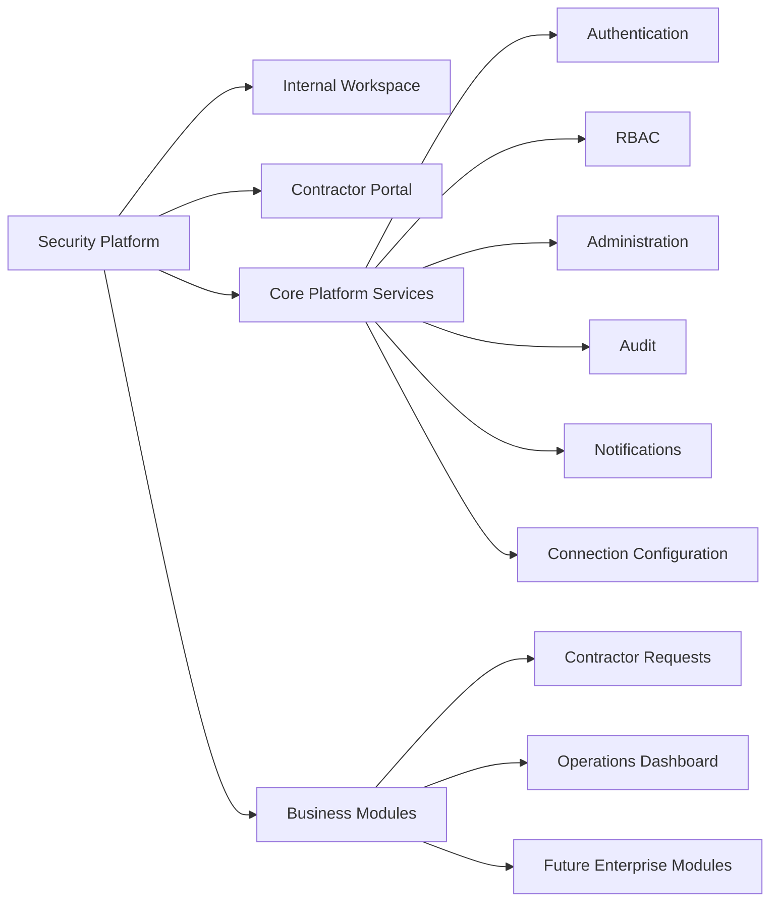
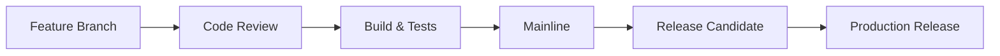

# Security Platform

<p align="center">
  
</p>

<p align="center">
  <strong>Единая корпоративная платформа для управления физической безопасностью предприятия.</strong>
</p>

<p align="center">
  
  
  
  
  
  
  
</p>

---

## Overview

**Security Platform** — это модульная enterprise-платформа для цифровизации процессов физической безопасности. Она объединяет внутреннюю рабочую область службы безопасности, администрирование, управление заявками подрядчикам, портал подрядчика, уведомления, аудит и интеграционные настройки в единую экосистему.

Платформа не является отдельным модулем Contractor Requests. Contractor Requests — первый производственный модуль внутри общей архитектуры Security Platform. Поверх общей базы уже реализованы authentication, RBAC, cookie sessions, CSRF, administration, Contractor Portal, operational Dashboard и безопасная модель доступа к данным.

## Platform Vision

Security Platform создаётся для устранения типичных проблем корпоративной физической безопасности:

- разрозненные системы и разные интерфейсы;
- дублирование справочников, пользователей и подрядчиков;
- ручные workflow без единого контроля статусов;
- отсутствие централизованного мониторинга;
- сложность аудита действий и доступа;
- слабая прозрачность сроков, назначений и результатов работ.

Платформа формирует единое рабочее пространство для службы безопасности и постепенно объединяет:

- Contractor Requests;
- Access Control;
- CCTV;
- Visitor Management;
- Incident Management;
- Monitoring;
- Notifications;
- Analytics;
- Reports.

## Platform Modules

| Module | Description | Status |
| --- | --- | --- |
| Contractor Requests | Управление заявками подрядчикам, назначениями, сроками, вложениями, комментариями и результатами работ. | ✅ Completed |
| Contractor Portal | Защищённая рабочая область подрядчика для просмотра назначений, задач, уведомлений и профиля. | ✅ Completed |
| Operations Dashboard | Внутренний центр управления безопасностью: KPI, внимание, сроки, подрядчики, события, статусы сервисов. | ✅ Completed |
| Administration | Компании, пользователи, роли, справочники, уведомления, аудит, подключения и состояние сервисов. | ✅ Completed |
| Identity & Access | Cookie authentication, RBAC, permission matrix, password lifecycle, local/LDAP/ADFS-ready модель. | ✅ Completed |
| Notification Center | Административные уведомления и отображение критичных событий в рабочей области. | ✅ Completed |
| Access Control | Управление доступом, зонами и событиями СКУД. | 🟡 Planned |
| CCTV | Интеграция видеонаблюдения и мониторинг событий. | 🟡 Planned |
| Visitor Management | Регистрация посетителей, пропуска и сопровождение. | 🟡 Planned |
| Incident Management | Регистрация, расследование и контроль инцидентов. | 🟡 Planned |
| Reporting & Analytics | Отчёты, аналитика и управленческие показатели. | 🟡 Planned |

## Architecture





Исходные Mermaid-файлы также находятся в [`docs/images`](docs/images).

## Technology Stack

| Area | Technologies |
| --- | --- |
| Backend | Python, FastAPI, SQLAlchemy, Alembic, Pydantic, PostgreSQL, uv |
| Frontend | React, TypeScript, Vite, Ant Design, Axios, React Router |
| Infrastructure | Docker Compose, Nginx-ready deployment model, PowerShell scripts, GitHub |
| Security | Cookie Authentication, CSRF, RBAC, Tenant Isolation, Password Policies, Audit Foundation |
| Documentation | Markdown, Mermaid, OpenAPI / Swagger |

## Current Features

### Authentication

- ✅ Local login with secure cookie session.
- ✅ HttpOnly cookie-based authentication.
- ✅ CSRF protection for state-changing requests.
- ✅ `/auth/me`, login, logout, refresh-ready session lifecycle.
- ✅ Password change flow for temporary and expired passwords.
- ✅ LDAP / ADFS configuration model.

### Administration

- ✅ Companies / contractors management.
- ✅ Internal and contractor users.
- ✅ Roles and permission matrix.
- ✅ Reference data: cities, facilities, premises, work types, responsibility zones.
- ✅ Connection configuration for LDAP, ADFS and SMTP.
- ✅ System status and administrative notifications.
- ✅ Audit foundation for administrative and workflow events.

### Workflow

- ✅ Contractor request lifecycle.
- ✅ Draft, publish, assignment and status transitions.
- ✅ Multiple work types per request.
- ✅ Contractor assignments.
- ✅ Comments and attachments.
- ✅ Work results.
- ✅ Request history.
- ✅ Deadline and overdue tracking.
- ✅ Generic Workflow Engine foundation with definitions, states, transitions, instances, execution log, SLA timers, idempotency, optimistic locking and outbox events.
- ✅ Workflow Center admin workspace for process definitions, versions, validation, instance explorer, SLA, outbox monitoring, audit and platform health.
- ✅ Contractor Requests remains on the approved business APIs and status behavior while the generic engine records and monitors the lifecycle.

### Workflow Center

Workflow Center is available under `/admin/workflow-center` for users with workflow permissions. The UI is intentionally generic: it operates on workflow definitions and instances without embedding Contractor Request business rules. Phase 3 adds read-only operational views plus protected definition lifecycle API endpoints; it does not add Phase 4 automation, BPMN execution, external integrations, scheduled transitions or visual diagram editing.

### Contractor Portal

- ✅ Protected contractor workspace.
- ✅ Contractor Dashboard.
- ✅ Requests and task workspace.
- ✅ Notifications.
- ✅ Contractor profile.
- ✅ Request detail view with comments, attachments, results and history.
- ✅ Tenant-safe contractor data access.

### Dashboard

- ✅ Security Operations Center at `/`.
- ✅ Attention-required cards.
- ✅ KPI metrics for requests, contractors and assignments.
- ✅ Request operations workspace.
- ✅ Status distribution.
- ✅ Contractor summary.
- ✅ Deadlines and recent activity.
- ✅ Platform service status.
- ✅ Permission-aware quick actions.

### Security

- ✅ Cookie Authentication.
- ✅ CSRF protection.
- ✅ RBAC and permission matrix.
- ✅ Password policy and password lifecycle.
- ✅ Session invalidation on logout.
- ✅ Tenant isolation for contractor data.
- ✅ Safe DTOs for contractor-facing APIs.
- ✅ Least privilege route guards.

## Security

Security Platform is designed around explicit security boundaries and permission-aware workflows.

| Security Area | Implementation |
| --- | --- |
| Cookie Authentication | Auth state is based on secure cookie sessions rather than localStorage tokens. |
| CSRF | State-changing API requests use CSRF validation. |
| RBAC | Roles are mapped to granular permissions and enforced by backend dependencies. |
| Permission Matrix | Internal pages and actions are visible only when the user has the required permission. |
| Password Policies | Local users follow password policy, temporary password flow and forced password change lifecycle. |
| Session Management | Logout invalidates the active session and clears frontend auth state. |
| Tenant Isolation | Contractor users only access data assigned to their company scope. |
| Audit Foundation | Administrative and workflow events are recorded through audit/history models. |
| Security Headers | Backend is structured for secure API operation behind the deployment layer. |
| Least Privilege | Contractor roles are separated from internal platform roles. |

> Frontend visibility is not treated as a security boundary. Backend permission checks remain the source of truth.

## Screenshots

| Area | Preview |
| --- | --- |
| Dashboard | `docs/screenshots/dashboard.png` |
| Contractor Portal | `docs/screenshots/contractor-portal.png` |
| Administration | `docs/screenshots/administration.png` |
| Companies | `docs/screenshots/companies.png` |
| Users | `docs/screenshots/users.png` |
| Requests | `docs/screenshots/requests.png` |
| Notifications | `docs/screenshots/notifications.png` |

> Screenshots can be added to `docs/screenshots/` as the product UI is reviewed and approved.

## Roadmap

| Version | Scope | Status |
| --- | --- | --- |
| v0.4 Foundation | Core FastAPI / React foundation, PostgreSQL model, migrations, Docker Compose, developer scripts. | ✅ Completed |
| v0.5 Workflow | Contractor Requests workflow, request statuses, assignment model, history. | ✅ Completed |
| v0.6 Collaboration | Attachments, comments, work results, request collaboration surface. | ✅ Completed |
| v0.7 Identity & Administration | Authentication, RBAC, users, roles, permissions, password lifecycle, connection configuration. | ✅ Completed |
| v0.8 Contractor Portal & Dashboard | Contractor Portal, protected contractor routes, operational internal Dashboard foundation. | ✅ Completed |
| v0.9 Operations Center | Enterprise UX unification, Security Operations Center, aggregate dashboard API, platform-wide internal workspace. | 🔵 Current |
| v1.0 Production Release | Production hardening, deployment documentation, monitoring, final QA and release governance. | 🟡 Planned |

## Project Structure

```text
.
├── backend/
│   ├── alembic/
│   ├── app/
│   └── tests/
├── frontend/
│   ├── public/
│   └── src/
├── docs/
│   ├── images/
│   ├── API_GUIDELINES.md
│   ├── ARCHITECTURE.md
│   ├── DEVELOPMENT.md
│   ├── ERD.md
│   └── ROADMAP.md
├── scripts/
├── docker-compose.yml
├── start-dev.cmd
├── stop-dev.cmd
└── README.md
```

## Getting Started

### Development

Перед запуском убедитесь, что порты `3000` и `8000` свободны.

| Scenario | Command |
| --- | --- |
| Обычный запуск | `.\start-dev.cmd` |
| Запуск с demo seed | `powershell -ExecutionPolicy Bypass -File scripts/start-dev.ps1 -Seed` |
| Принудительный перезапуск только процессов этого проекта | `powershell -ExecutionPolicy Bypass -File scripts/start-dev.ps1 -ForceRestart` |
| Остановка | `.\stop-dev.cmd` |

### Docker

```bash
docker compose up --build
```

### Backend

```bash
cd backend
uv run alembic upgrade head
uv run fastapi dev app/main.py
```

### Frontend

```bash
cd frontend
npm install
npm run dev -- --host 127.0.0.1 --port 3000
```

### Seed Demo

```powershell
powershell -ExecutionPolicy Bypass -File scripts/start-dev.ps1 -Seed
```

### Admin Login

Demo credentials are created by the development seed. Use the seeded internal Platform Admin account for local verification.

| Service | URL |
| --- | --- |
| Frontend | http://127.0.0.1:3000 |
| Backend API | http://127.0.0.1:8000 |
| Swagger | http://127.0.0.1:8000/docs |
| Health | http://127.0.0.1:8000/api/v1/health |

## Version History

| Version | Highlights |
| --- | --- |
| v0.4 | Platform foundation, backend/frontend shell, migrations, Docker Compose, demo seed. |
| v0.5 | Contractor Requests workflow, statuses, assignments, request history. |
| v0.6 | Collaboration layer: attachments, comments, work results and notifications foundation. |
| v0.7 | Identity and administration: users, roles, permissions, password lifecycle, LDAP/ADFS/SMTP configuration model. |
| v0.8 | Contractor Portal, protected contractor workspace, Dashboard foundation. |
| v0.9 | Operations Center, aggregate Dashboard API, enterprise UX/UI unification and platform workspace refinement. |

## Future Modules

- Access Control
- Video Surveillance
- Visitor Management
- Incident Response
- Monitoring
- Reporting
- Analytics
- Mobile Client
- API Gateway

## Documentation

| Document | Description |
| --- | --- |
| [`docs/ARCHITECTURE.md`](docs/ARCHITECTURE.md) | Архитектурное описание платформы. |
| [`docs/API_GUIDELINES.md`](docs/API_GUIDELINES.md) | Подходы к API и контрактам. |
| [`docs/DEVELOPMENT.md`](docs/DEVELOPMENT.md) | Инструкции для локальной разработки. |
| [`docs/ERD.md`](docs/ERD.md) | Модель данных и связи сущностей. |
| [`docs/ROADMAP.md`](docs/ROADMAP.md) | План развития продукта. |
| `docs/security.md` | Будущая документация по security controls. |
| `docs/deployment.md` | Будущая документация по production deployment. |

<details>
<summary>Development Workflow</summary>



</details>

## License

Internal Corporate Project.

---

<p align="center">
  <strong>Security Platform</strong><br />
  Enterprise Physical Security Platform<br />
  Designed for enterprise physical security operations.
</p>
