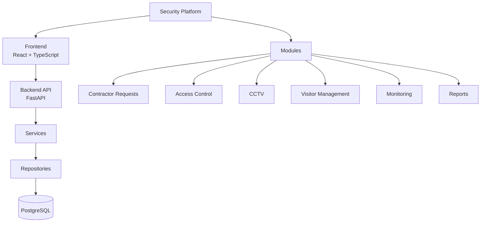
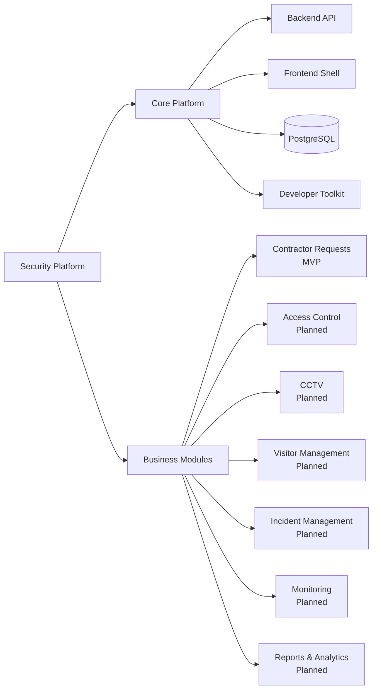
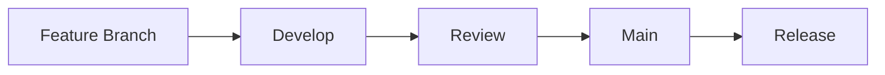

# 🛡 Security Platform


Security Platform — единая корпоративная платформа управления физической безопасностью предприятия.

Платформа предназначена для объединения различных сервисов службы безопасности в одном веб-приложении с общей архитектурой, единым интерфейсом и централизованным управлением.

На текущий момент реализуется первый модуль:

**✔ Contractor Requests**

| Параметр | Значение |
| --- | --- |
| Current Release | v0.4.x |
| Development Status | Active Development |
| First Module | Contractor Requests |

---

# 🎯 Цели проекта

Security Platform создаётся как масштабируемая основа для автоматизации процессов физической безопасности и постепенного объединения сервисов службы безопасности в едином продукте.

В будущем платформа должна объединять:

- Contractor Requests
- Access Control
- CCTV
- Visitor Management
- Incident Management
- Monitoring
- Reports & Analytics
- другие сервисы службы безопасности

Ключевой принцип развития — модульная архитектура. Каждый новый сервис должен подключаться к общей платформенной инфраструктуре, использовать единые подходы к API, интерфейсу, данным и процессам разработки.

---

# 🏗 Архитектура





Исходные Mermaid-файлы: [architecture.mmd](docs/images/architecture.mmd) и [modules.mmd](docs/images/modules.mmd).

Архитектура разделяет пользовательский интерфейс, API, сервисную логику, слой доступа к данным и PostgreSQL. Модули развиваются поверх общей платформенной базы, что позволяет добавлять новые домены без превращения репозитория в набор несвязанных приложений.

Подробнее: [Architecture](docs/ARCHITECTURE.md).

---

# 📦 Реализованные возможности

## Core Platform

| Возможность | Статус |
| --- | --- |
| FastAPI | ✅ |
| React | ✅ |
| TypeScript | ✅ |
| PostgreSQL | ✅ |
| Alembic | ✅ |
| Swagger | ✅ |
| Docker Compose | ✅ |
| Design System | ✅ |
| Demo Seed | ✅ |
| Health Check | ✅ |
| Developer Toolkit | ✅ |
| Start/Stop Scripts | ✅ |

## Contractor Requests

| Возможность | Статус |
| --- | --- |
| Reference Data | ✅ |
| Contractor Requests API | ✅ |
| Assignment Engine | ✅ |
| Multiple Work Types | ✅ |
| Demo Data | ✅ |
| Contractor API | ✅ |
| Automated Tests | ✅ |

---

# 🛣 Roadmap

| Версия | Возможности | Статус |
| --- | --- | --- |
| v0.4.x | Security Platform Foundation | ✅ |
| v0.5 | Workflow Engine<br>Draft<br>Status Engine<br>History | 🟡 |
| v0.6 | Attachments<br>Comments<br>Notifications | 🟡 |
| v0.7 | Authentication<br>Roles<br>Permissions | 🟡 |
| v0.8 | Contractor Portal | 🟡 |
| v0.9 | Monitoring<br>Analytics | 🟡 |
| v1.0 | Production Release | ⬜ |

Подробнее: [Roadmap](docs/ROADMAP.md).

---

# ⚙ Technology Stack

| Area | Technologies |
| --- | --- |
| Backend | Python, FastAPI, SQLAlchemy, Alembic, PostgreSQL, Pydantic, uv |
| Frontend | React, TypeScript, Vite, Ant Design, Axios, React Router |
| Infrastructure | Docker Compose, PowerShell, Swagger/OpenAPI, GitHub |

---

# 🚀 Быстрый запуск

Перед запуском убедитесь, что порты `3000` и `8000` свободны.

| Сценарий | Команда |
| --- | --- |
| Обычный запуск | `.\start-dev.cmd` |
| Принудительный перезапуск только процессов этого проекта | `powershell -ExecutionPolicy Bypass -File scripts/start-dev.ps1 -ForceRestart` |
| Запуск с demo seed | `powershell -ExecutionPolicy Bypass -File scripts/start-dev.ps1 -Seed` |
| Остановка | `.\stop-dev.cmd` |

Подробная инструкция: [Development Guide](docs/DEVELOPMENT.md).

---

# 🌐 URL

| Сервис | URL |
| --- | --- |
| Frontend | http://127.0.0.1:3000 |
| Backend | http://127.0.0.1:8000 |
| Swagger | http://127.0.0.1:8000/docs |
| Health | http://127.0.0.1:8000/api/v1/health |

---

# 📁 Структура проекта

```text
.
├── backend/
├── frontend/
├── scripts/
├── docs/
│   ├── ARCHITECTURE.md
│   ├── ROADMAP.md
│   ├── ERD.md
│   ├── API_GUIDELINES.md
│   ├── DEVELOPMENT.md
│   ├── README.md
│   └── images/
├── docker-compose.yml
└── README.md
```

---

# 📌 Модули платформы

| Модуль | Статус |
| --- | --- |
| Contractor Requests | ✅ MVP |
| Access Control | 🚧 Planned |
| CCTV | 🚧 Planned |
| Visitor Management | 🚧 Planned |
| Incident Management | 🚧 Planned |
| Monitoring | 🚧 Planned |
| Reports & Analytics | 🚧 Planned |

---

# 🔄 Development Workflow



Базовый процесс: создать feature-ветку, выполнить разработку, проверить изменения локально, открыть Pull Request, пройти review и выполнить merge в `develop` в соответствии с принятой Git Flow-моделью.

---

# 📄 License

Internal Corporate Project.
