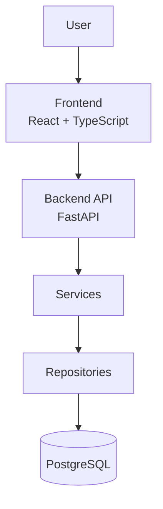
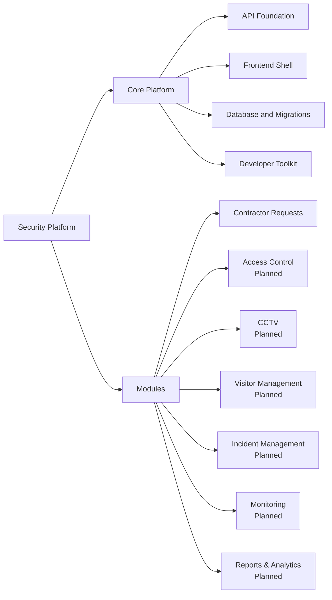

# Architecture

Security Platform построена как единое веб-приложение с разделением ответственности между frontend, API, сервисной логикой, слоем доступа к данным и PostgreSQL.

## Application Layers

| Layer | Responsibility |
| --- | --- |
| Frontend | Web interface, routing, forms, dashboards and user workflows. |
| Backend API | REST endpoints, request validation, OpenAPI documentation and dependency wiring. |
| Services | Business logic, orchestration, validation rules and module behavior. |
| Repositories | Data access boundary and query encapsulation where the module needs it. |
| Database | PostgreSQL persistence managed through SQLAlchemy and Alembic migrations. |

## Separation of Responsibilities

The platform keeps business logic out of UI components and avoids coupling HTTP handlers directly to persistence details. API routes expose module capabilities, services coordinate business operations, and database models represent persisted state.

Current implementation already follows this direction in the Contractor Requests module:

- API routes expose request, reference data, contractor and health endpoints.
- Service logic validates request scope, applies premise contacts and assigns contractors by work type.
- SQLAlchemy models define persisted entities and relationships.
- Alembic manages schema evolution.

## Module Structure

Contractor Requests is the first implemented business module. Planned modules should reuse the same platform foundation instead of introducing isolated applications.

## Frontend and Backend Interaction

Frontend communicates with Backend API over HTTP. Backend responses are documented through Swagger/OpenAPI and should remain stable, versioned and predictable.

| Direction | Description |
| --- | --- |
| Frontend to API | UI sends JSON requests to REST endpoints. |
| API to Services | Routes delegate business decisions to service functions. |
| Services to Database | Services validate and persist data through SQLAlchemy sessions and model relationships. |
| API to Frontend | API returns structured JSON responses and standard HTTP status codes. |

## Platform Scalability

Security Platform is designed to scale by adding modules around a shared core:

- shared routing and API conventions;
- shared frontend design system and navigation patterns;
- shared database migration process;
- consistent module boundaries;
- common developer scripts and documentation;
- clear roadmap for workflow, authentication, notifications, monitoring and reports.

The goal is to grow Security Platform into a portfolio of security services while keeping operational and development practices unified.
