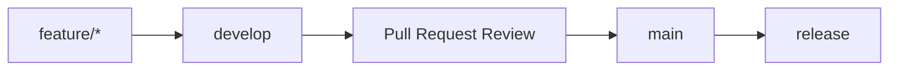

# Development Guide

This guide describes the local development workflow for Security Platform.

## Clone

```bash
git clone <repository-url>
cd contractor-requests
```

The repository name may still reflect the first module, but the product documented here is Security Platform.

## Start

Use the platform start script from the repository root:

```powershell
.\start-dev.cmd
```

The script checks required tooling, verifies ports, prepares dependencies, runs migrations and starts backend and frontend services.

## Start-dev with Seed

To load demo data during startup:

```powershell
powershell -ExecutionPolicy Bypass -File scripts/start-dev.ps1 -Seed
```

## Stop-dev

```powershell
.\stop-dev.cmd
```

## Swagger

After startup, Swagger is available at:

```text
http://127.0.0.1:8000/docs
```

## Tests

Backend tests are run from the backend directory:

```bash
cd backend
uv sync
uv run pytest
```

Frontend checks depend on the scripts configured in `frontend/package.json`.

## Seed

Demo seed can be executed explicitly from the backend directory:

```bash
cd backend
uv run python -m app.scripts.seed_demo
```

Seed data is intended for local development and demonstration.

## URLs

| Service | URL |
| --- | --- |
| Frontend | http://127.0.0.1:3000 |
| Backend | http://127.0.0.1:8000 |
| Swagger | http://127.0.0.1:8000/docs |
| Health | http://127.0.0.1:8000/api/v1/health |

## Git Flow

Security Platform development should follow a controlled branch flow:



## Feature Branch

Create a feature branch from the current development branch:

```bash
git checkout develop
git pull
git checkout -b feature/<short-description>
```

## Work Through develop

Feature work should target `develop`. The `main` branch should represent reviewed and release-ready changes.

## Pull Request

Each Pull Request should include:

- short summary of the change;
- affected module or platform area;
- local verification notes;
- screenshots for visible UI changes;
- migration notes when database changes are included.

No documentation change should imply production readiness unless the related functionality is actually implemented.
