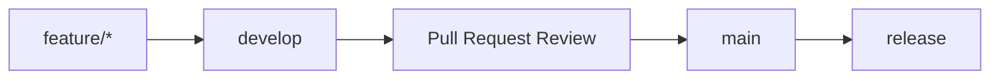

# Development Guide

This guide describes the local development workflow for Security Platform.

## Clone

```bash
git clone <repository-url>
cd contractor-requests
```

The repository name may still reflect the first module, but the product documented here is Security Platform.

## Start

Use the platform start script from the repository root:

```powershell
.\start-dev.cmd
```

The script checks required tooling, detects stale runtime state, verifies ports, prepares dependencies, runs migrations, runs Platform Doctor, starts backend and frontend services, verifies readiness/health/version/frontend reachability, and prints a versioned startup banner.

Before launching backend and frontend processes, `scripts/start-dev.ps1` runs Platform Doctor. Startup continues when Doctor reports warnings only. If Doctor reports errors, startup aborts unless `-Force` is supplied.

## Start-dev with Seed

To load demo data during startup:

```powershell
powershell -ExecutionPolicy Bypass -File scripts/start-dev.ps1 -Seed
```

## Stop-dev

```powershell
.\stop-dev.cmd
```

The stop script only terminates processes verified as belonging to the current project by saved PID metadata or command line ownership. It reports PID, command line, start time, port and project ownership for remaining blockers. If Windows denies termination, it keeps the process untouched and prints diagnostics instead of hiding the problem.

## Swagger

After startup, Swagger is available at:

```text
http://127.0.0.1:8000/docs
```

Development CSP explicitly allows Swagger assets and local Vite websocket connections. Production CSP is stricter; see `docs/SECURITY.md`.

## Tests

Backend tests are run from the backend directory:

```bash
cd backend
uv sync
uv run pytest
```

Frontend checks depend on the scripts configured in `frontend/package.json`.

## Security Configuration

Development uses explicit localhost CORS origins and non-secure cookies. Production must set approved HTTPS origins, non-placeholder secrets, and secure cookie/HSTS settings.

Common security variables:

- `BACKEND_CORS_ORIGINS`
- `AUTH_TOKEN_SECRET`
- `CONNECTION_SECRETS_KEY`
- `AUTH_COOKIE_SAMESITE`
- `AUTH_COOKIE_PATH`
- `AUTH_COOKIE_DOMAIN`
- `PUBLIC_BASE_URL`
- `HSTS_ENABLED`
- `MAX_REQUEST_BODY_BYTES`
- `MAX_JSON_BODY_BYTES`
- `MAX_MULTIPART_BODY_BYTES`
- `MAX_UPLOAD_FILE_BYTES`
- `MAX_FILES_PER_REQUEST`
- `DEFAULT_PAGE_LIMIT`
- `MAX_PAGE_LIMIT`
- `MAX_SEARCH_LENGTH`
- `APP_DEBUG`

Reverse proxies should enforce matching upload/body limits before requests reach the backend.

## Platform Doctor

Platform Doctor 2.0 verifies the local development environment before startup and after upgrades. It returns high-level categories for operators and detailed diagnostics for developers.

Run from the `backend` directory:

```bash
uv run python -m app.scripts.platform_doctor
```

Machine-readable output:

```bash
uv run python -m app.scripts.platform_doctor --json
```

Summary output:

```bash
uv run python -m app.scripts.platform_doctor --summary
```

Verbose text output without ANSI colors:

```bash
uv run python -m app.scripts.platform_doctor --verbose --no-color
```

Safe local fixes:

```bash
uv run python -m app.scripts.platform_doctor --fix
```

`--fix` may recreate missing local folders, create runtime folders, clear stale pid files, and remove stale lock files. It never deletes the database, stamps Alembic, runs migrations, changes passwords, inserts seed data, or modifies business data.

Doctor checks:

- Core: platform version, database, Alembic, Workflow Engine, RBAC, correlation, logging, readiness and health endpoint registration.
- Security: CSP, security headers, cookies, CSRF inventory and CORS.
- Infrastructure: storage, upload limits, request limits, environment, startup scripts, stop scripts and migration validation tooling.
- Optional integrations: SMTP, LDAP and ADFS. Disabled optional integrations are warnings only.
- Python, `uv`, virtual environment, and backend dependencies.
- Database connection, engine, path, writability, and SQLite foreign key mode.
- Alembic current/head revision and missing migration diagnostics.
- Workflow tables, indexes, foreign keys, and row counts.
- RBAC roles, permissions, duplicate mappings, and orphan mappings.
- Authentication tables, password policy, temporary password settings, and CSRF cookie settings.
- Contractor tables for contractors, memberships, assignments, requests, and history.
- Demo seed users, contractor request workflow definition/version, and stable reference IDs.
- `backend/storage` existence and writability.
- `.env`, required development variables, JWT/secret configuration, SMTP, LDAP, and ADFS status without printing secret values.

Troubleshooting examples:

```text
Workflow tables exist but Alembic revision is older than workflow migration
```

Run:

```bash
uv run python -m app.scripts.recover_partial_workflow_migration --dry-run
```

```text
Database revision does not match Alembic head
```

Run:

```bash
uv run alembic upgrade head
```

```text
Storage folder is missing
```

Run:

```bash
uv run python -m app.scripts.platform_doctor --fix
```

## Version Policy

The authoritative platform version is stored in the repository root `VERSION` file. Backend runtime metadata, FastAPI OpenAPI, `/api/v1/version`, readiness metadata and frontend version display all read or synchronize to that value. Package metadata in `backend/pyproject.toml` and `frontend/package.json` must match `VERSION`.

Check the current version:

```bash
cd backend
uv run python -m app.scripts.version
```

## Migration Validation

Validate migrations and seed idempotency on a temporary SQLite database:

```bash
cd backend
uv run python -m app.scripts.validate_migrations
uv run python -m app.scripts.validate_migrations --json
```

The validator checks clean upgrade to head, SQLite compatibility, foreign key metadata for future PostgreSQL readiness, downgrade-by-one when supported, and demo seed idempotency by running seed twice. It never touches `dev.db` unless an explicit `--database-path` is supplied.

## Workflow Center

Workflow Center is available in the admin shell at:

```text
/admin/workflow-center
```

Backend API prefix:

```text
/api/v1/admin/workflow-center
```

Useful development checks from the backend directory:

```bash
uv run pytest tests/test_workflow_center_api.py
uv run python -m app.scripts.platform_doctor
uv run alembic upgrade head
uv run python -m app.scripts.seed_demo
uv run python -m app.scripts.seed_demo
```

Frontend validation from the frontend directory:

```bash
npm run build
```

Phase 3 scope is limited to the generic administrative and operational surface. Do not add Phase 4 automation, scheduled transitions, event-driven transitions, external integrations, BPMN execution or visual diagram authoring as part of Workflow Center maintenance.

## Seed

Demo seed can be executed explicitly from the backend directory:

```bash
cd backend
uv run python -m app.scripts.seed_demo
```

Seed data is intended for local development and demonstration.

## URLs

| Service | URL |
| --- | --- |
| Frontend | http://127.0.0.1:3000 |
| Backend | http://127.0.0.1:8000 |
| Swagger | http://127.0.0.1:8000/docs |
| Health | http://127.0.0.1:8000/api/v1/health |

## Git Flow

Security Platform development should follow a controlled branch flow:



## Feature Branch

Create a feature branch from the current development branch:

```bash
git checkout develop
git pull
git checkout -b feature/<short-description>
```

## Work Through develop

Feature work should target `develop`. The `main` branch should represent reviewed and release-ready changes.

## Pull Request

Each Pull Request should include:

- short summary of the change;
- affected module or platform area;
- local verification notes;
- screenshots for visible UI changes;
- migration notes when database changes are included.

No documentation change should imply production readiness unless the related functionality is actually implemented.
