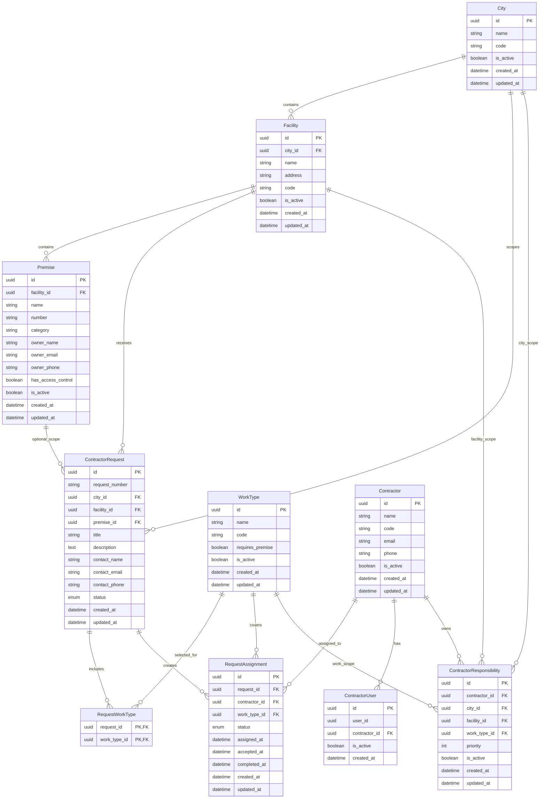

# ERD

This document reflects existing database entities found in the current codebase. Planned modules are not included in the ERD until their entities exist in code.

## Notes

- `RequestWorkType` is a real association table between requests and work types.
- `ContractorResponsibility` is used by the assignment logic to find the contractor responsible for a work type in a city or facility scope.
- `ContractorUser` links platform users to contractors; user identity storage is not represented here because a dedicated user entity is not present in the current codebase.
